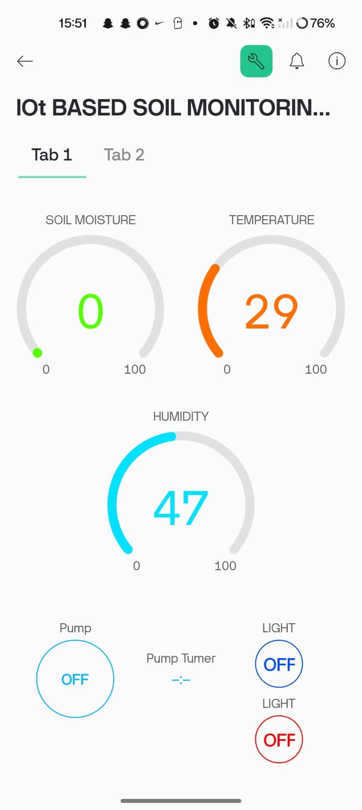
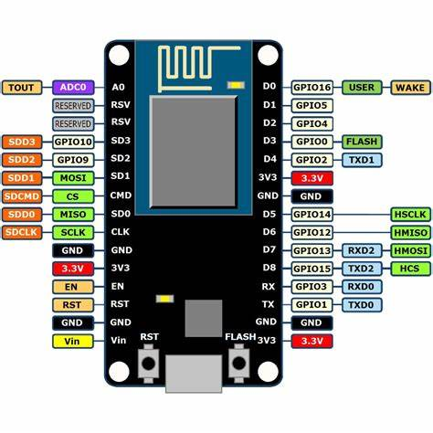

-->APPLICATION LAYOUT<--

    
    

 
 
--> Demonstration Video <--
watch This :)

https://github.com/user-attachments/assets/727a9491-5261-45f5-985e-10ba9051bf1e

-->IoT-Based Soil Monitoring and Irrigation System<--

## Summary

This project implements an IoT-based soil monitoring and irrigation system using Arduino IDE, NodeMCU ESP8266 module, and Blynk IoT. The system monitors soil moisture levels and automatically controls the irrigation process, ensuring optimal water usage for agricultural applications.

## Features

- **Real-Time Soil Monitoring**: Continuously monitors soil moisture levels using soil moisture sensors.
- **Automated Irrigation**: Automatically activates and deactivates the irrigation system based on soil moisture thresholds.
- **Remote Monitoring and Control**: Allows users to monitor and control the system remotely via the Blynk IoT platform.
- **Data Logging**: Logs soil moisture data for analysis and future reference.

## Components

- NodeMCU ESP8266 Module
-temperature sensor 
- lights 
- Soil Moisture Sensors
- Relay Module
- Water Pump
- Power Supply
- Blynk IoT Platform

## Installation and Setup

1. **Hardware Connections**:
   - Connect the soil moisture sensors to the NodeMCU ESP8266.
   - Connect the relay module to the NodeMCU ESP8266 to control the water pump.
   - Connect the water pump to the relay module.
   - Ensure all connections are secure and powered correctly.

2. **Software Setup**:
   - Install the Arduino IDE from [arduino.cc](https://www.arduino.cc/en/Main/Software).
   - Install the ESP8266 board package in Arduino IDE.
   - Install the Blynk library in Arduino IDE.

3. **Blynk Setup**:
   - Create a new project on the Blynk app.
   - Add widgets for soil moisture monitoring and irrigation control.
   - Obtain the Blynk Auth Token and update it in the Arduino code.

4. **Upload Code**:
   - Open the provided Arduino code in the Arduino IDE.
   - Update the Wi-Fi credentials and Blynk Auth Token in the code.
   - Upload the code to the NodeMCU ESP8266 module.

## Usage

1. **Monitor Soil Moisture**: Use the Blynk app to monitor real-time soil moisture levels.
2. **Control Irrigation**: Use the Blynk app to manually control the irrigation system or let it operate automatically based on the soil moisture levels.
